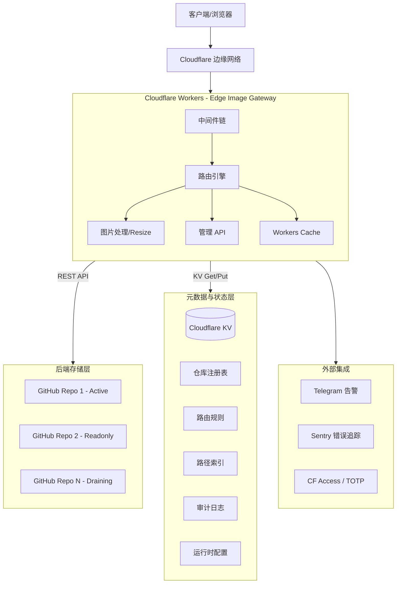

# Edge Image Gateway 系统架构详解

## 1. 项目概述

Edge Image Gateway 是一个基于 **Cloudflare Workers** 构建的企业级边缘图片网关。它将 **GitHub** 作为高容量、低成本的后端存储，利用 Cloudflare 的全球边缘网络实现图片的实时处理、多级缓存、访问控制和多仓库管理。

该项目不仅仅是一个简单的图床，而是一个集成了实时缩放（Image Resizing）、多维度安全防护、智能路由分发和自动化运维监控的完整图片服务解决方案。

---

## 2. 总体架构图



---

## 3. 请求生命周期 (Request Lifecycle)

### 3.1 中间件链 (Middleware Stack)
每个进入网关的请求都会经过预定义的中间件序列。任何中间件都可以根据安全策略中断请求并返回响应：

1.  **Rate Limiter (速率限制)**: 基于 IP 的令牌桶算法，防止滥用。
2.  **Referer Guard (防盗链)**: 校验 `Referer` 请求头是否在白名单内（支持通配符）。
3.  **Signature Guard (签名/熔断)**:
    *   验证写操作或分享链接的 HMAC-SHA256 签名。
    *   检查全局 `EMERGENCY_LOCKDOWN` 状态，必要时拦截所有写入请求。
4.  **Admin Auth (管理认证)**: 保护 `/admin` 路径，支持 Cloudflare Access (OIDC) 或 TOTP 双因素认证。

### 3.2 路由分发逻辑
路由引擎 ([src/services/repoRouter.ts](../src/services/repoRouter.ts)) 负责将请求映射到具体的 GitHub 仓库：

*   **读取路由**:
    1.  **路径索引匹配**: 先查询 KV 中的 `path::{path}`，若存在则直接定位到目标仓库。
    2.  **前缀规则匹配**: 遍历 `route::read_rules` 中的前缀匹配规则。
    3.  **兜底路由**: 使用当前活跃的写仓库作为 fallback。
*   **写入路由**:
    *   从 `route::current_write` 获取当前活跃仓库。
    *   系统会自动检查仓库容量，若已满则根据预定义的备选列表自动切换。

### 3.3 图片处理流程 (Image Resizing)
当请求带有 `w`, `h`, `q` 等处理参数时：
1.  Worker 生成一个指向自身的内部回环 URL。
2.  通过 Cloudflare Image Resizing 功能再次发起 fetch 请求。
3.  回环请求携带特殊的 HMAC 签名，跳过中间件的二次校验，直接从后端拉取原图。
4.  Cloudflare 边缘节点执行图片转换操作并将结果返回给客户端。

---

## 4. 存储引擎与多仓库管理

### 4.1 GitHub 存储层
系统将图片存储在普通 GitHub 仓库中，通过 GitHub REST API 进行文件操作。
*   **分片/目录优化**: 自动根据日期或哈希对文件进行分层存储，避免单目录文件过多导致 GitHub 性能下降。
*   **SHA256 校验**: 上传前计算文件哈希，避免重复存储（可选配置）。

### 4.2 多仓库水平扩展
为了突破单仓库容量或速率限制，系统支持注册无限个 GitHub 仓库：
*   **状态模型**: `active` (读写), `readonly` (仅读), `draining` (迁移中), `archived` (归档)。
*   **容量同步**: 通过 Cron Trigger 定时任务自动调用 GitHub API 同步各仓库的 `sizeBytes` 和 `fileCount`。
*   **自动切换策略**: 当当前写仓库达到硬限制（如 5GB）时，路由引擎会自动将写目标指向下一个 `active` 仓库。

---

## 5. 数据持久化方案 (KV 设计)

系统使用 Cloudflare KV 存储所有关键元数据。由于 KV 的最终一致性特性，系统在服务层加入了 30 秒的内存缓存以平滑读写波动。

| 键模式 (Key Pattern) | 描述 | 数据示例 |
| :--- | :--- | :--- |
| `repo::{id}` | 仓库元数据 (Owner, Name, Branch, Capacity) | `{ "id": "repo-main", "sizeBytes": 2147483648, ... }` |
| `route::read_rules` | 路径前缀路由规则列表 | `[ { "prefix": "/blog", "repo": "repo-blog" }, ... ]` |
| `route::current_write` | 当前正在使用的写仓库 ID | `"repo-uploads-2025"` |
| `path::{path}` | 路径索引，加速读取定位 | `{ "repo": "repo-blog", "sha": "..." }` |
| `audit::{timestamp}` | 全局审计日志条目 | `{ "action": "file_delete", "user": "admin@example.com" }` |
| `kv_config::{key}` | 运行时配置开关 (熔断、白名单等) | `"emergency_lockdown": "true"` |

---

## 6. 安全模型 (Security Layers)

项目采用深度防御（Defense in Depth）策略：

| 维度 | 机制 | 说明 |
| :--- | :--- | :--- |
| **接入层** | IP 速率限制 | 令牌桶算法，每分钟限制请求数，防止 DDoS 攻击。 |
| **内容层** | Referer 防盗链 | 基于白名单的请求头校验，支持临时分享链接绕过。 |
| **操作层** | HMAC 签名 | 写操作和分享链接必须携带由 `SIGN_SECRET` 生成的 HMAC 签名。 |
| **管理层** | Cloudflare Access | 通过 Zero Trust 隧道保护管理面板，仅允许指定邮箱访问。 |
| **运维层** | 紧急熔断 | KV 一键关闭所有写操作，在遭受攻击或系统异常时快速保护后端。 |
| **数据层** | Token 隔离 | 支持每个仓库使用独立的 GitHub Token，实现权限最小化。 |

---

## 7. 性能优化与缓存架构

系统构建了多级缓存体系以确保毫秒级的图片分发：

1.  **Workers Cache (L1)**: 使用标准的 Workers Cache API 缓存成功的响应。对于带处理参数的请求，会根据 `w/h/q/fit` 参数生成缓存 Key 变体。
2.  **Browser Cache (L2)**: 设置 `Cache-Control: public, max-age=604800, immutable`，最大化利用浏览器本地缓存。
3.  **Memory Cache (L3)**: 在 Worker 实例的全局范围内缓存仓库元数据（30s），减少 KV 读取次数和延迟。
4.  **Negative Cache**: 针对 404 响应设置短时间的负缓存（60s），防止缓存穿透攻击。

---

## 8. 自动化与可观测性

*   **Cron Triggers**: 定时执行仓库统计同步任务。
*   **告警系统**: 发生 5xx 错误、仓库容量不足或紧急熔断触发时，实时通过 Telegram Bot 发送通知。
*   **审计追踪**: 所有通过管理面板进行的敏感操作（上传、删除、配置变更）都会永久记录在 KV 审计日志中。
*   **Sentry 集成**: 自动捕获运行时未处理的异常并上报到 Sentry。

---

## 9. 项目目录结构

```text
src/
├── index.ts                # 应用入口与生命周期管理
├── middleware/             # 核心安全中间件
├── routes/                 # 业务逻辑路由 (图片服务 + 管理 API)
│   ├── image.ts            # 公开图片处理端点
│   └── admin/              # 管理面板路由与 API
├── services/               # 基础设施服务 (GitHub API, Repo Router, DB)
└── utils/                  # 工具类 (Cache, Crypto, Logger, Mime)
```

---

## 10. 技术栈总结

*   **运行时**: [Cloudflare Workers](https://workers.cloudflare.com/) (V8 Isolates)
*   **框架**: [Hono](https://hono.dev/) (极速轻量级 Web 框架)
*   **语言**: TypeScript
*   **存储**: GitHub REST API v3
*   **元数据**: Cloudflare KV
*   **图片处理**: Cloudflare Image Resizing
*   **测试**: Vitest + Miniflare
