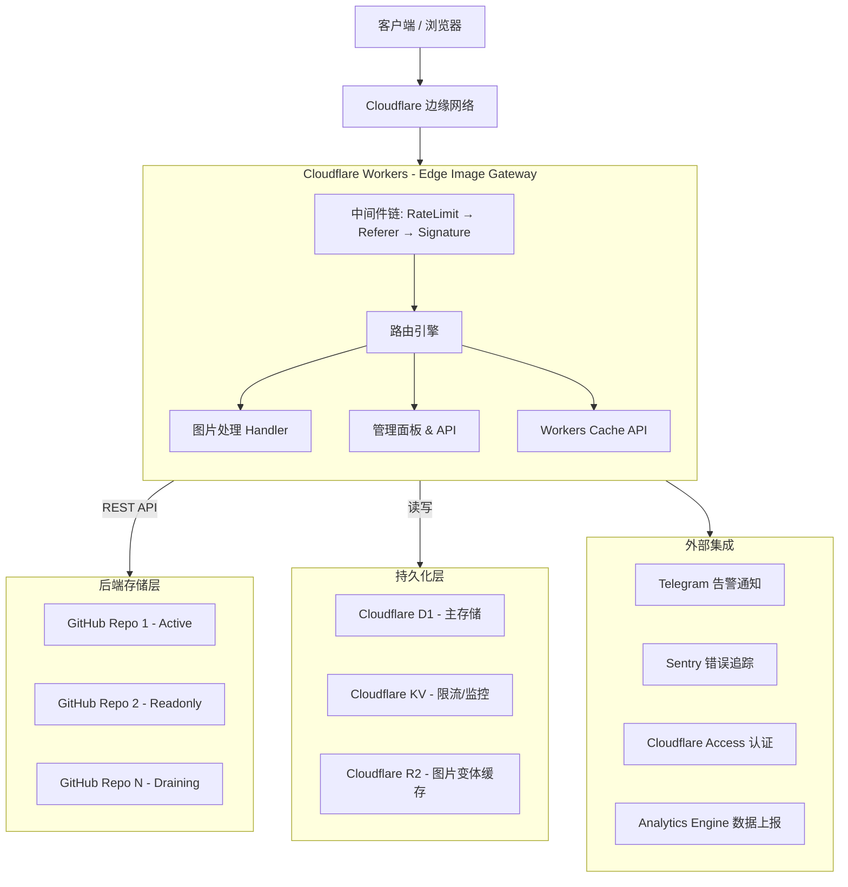

# Edge Image Gateway 系统架构详解

## 1. 项目概述

Edge Image Gateway 是一个基于 **Cloudflare Workers** 构建的企业级边缘图片网关。它将 **GitHub** 作为高容量、低成本的后端存储，利用 Cloudflare 的全球边缘网络实现图片的实时处理、多级缓存、访问控制和多仓库管理。

该项目集成了实时图片缩放（Image Resizing）、多维度安全防护、智能路由分发、仓库迁移、管理面板和自动化运维监控，是一个完整的图片服务解决方案。

---

## 2. 总体架构图



---

## 3. 请求生命周期

### 3.1 中间件链

每个请求按照以下顺序经过全局中间件（`/healthz` 路由除外）：

1. **Rate Limiter（速率限制）**
   - 混合模式：本地内存 + KV 持久化
   - 基于 `CF-Connecting-IP` 的每分钟令牌桶限流（默认 120 次/分钟）
   - 404 惩罚机制：同一 IP 在一分钟内触发 20 次 404 后，自动通过 KV 封禁 5 分钟

2. **Referer Guard（防盗链）**
   - 校验 `Referer` / `Origin` 请求头是否在 `ALLOWED_REFERERS` 白名单内（支持通配符子域名匹配）
   - 使用 `Sec-Fetch-Dest: image` 区分浏览器正常图片加载与工具抓取，允许浏览器的空 Referer 请求
   - 签名路径（`/private/`、`/draft/`、`/raw/`）和已携带 `sig` 参数的请求自动跳过

3. **Signature Guard（签名 / 熔断）**
   - **紧急熔断**：`EMERGENCY_LOCKDOWN` 开启时，所有请求必须携带有效签名
   - **可信来源绕过**：来自白名单域名的浏览器图片请求（`Sec-Fetch-Dest: image`）可跳过签名
   - **分级路径防御**：`/private/`、`/draft/`、`/raw/` 路径强制要求 HMAC 签名
   - **全局签名模式**：`ENABLE_SIGNATURE=true` 时所有非可信请求强制签名
   - **内部回环签名**：图片处理时 Worker 自调用使用 `__internal_loopback` + `__sig` 参数绕过二次校验
   - 签名格式：`sig=HMAC-SHA256(path|exp)&exp=unix_timestamp`，支持过期时间校验

### 3.2 路由分发逻辑

路由引擎 [src/services/repoRouter.ts](../src/services/repoRouter.ts) 负责将请求映射到具体的 GitHub 仓库：

**读取路由**（`resolveForRead`）：
1. D1 精确路径查询（`paths` 表）
2. KV 降级查询（`path::` 前缀）
3. 前缀规则匹配（`route::read_rules`）
4. 当前写仓库兜底（`route::current_write`）
5. 首个可用仓库作为最终兜底
6. 无注册仓库时使用环境变量 `GITHUB_USER` / `GITHUB_REPO` 作为 fallback

**写入路由**（`resolveForWrite`）：
- 从 `route::current_write` 获取当前活跃仓库
- 自动检查仓库容量（`sizeBytes + requiredBytes <= capacityLimitBytes`），超出时自动切换到下一个活跃仓库
- 支持通过 D1 原子更新写入目标

### 3.3 图片处理流程

当请求带有 `w`、`h`、`q`、`fit` 等处理参数时：

1. 生成指向自身的回环 URL，携带 `__internal_loopback=true` 和 HMAC 签名
2. 通过 `cf.image` 选项发起 fetch 请求，触发 Cloudflare Image Resizing
3. 回环请求经过签名校验后直接从 GitHub 拉取原图
4. Cloudflare 边缘节点执行缩放转换并返回结果
5. 若回环请求失败（415/400），降级为直接返回原始文件

---

## 4. 存储引擎与多仓库管理

### 4.1 GitHub 存储层

通过 GitHub REST API v3 操作文件，使用 `Authorization: Bearer <token>` 认证。

- **路径编码**：自动对路径各段进行 `encodeURIComponent`
- **SHA256 哈希**：上传时计算文件哈希，支持去重
- **元数据剥离**：上传 JPEG/PNG 时自动移除 EXIF 等元数据（[src/utils/imageProcessor.ts](../src/utils/imageProcessor.ts)）
- **速率监控**：每次 API 调用后记录 `X-RateLimit-Remaining`，低于 1000 时触发 Telegram 告警

### 4.2 多仓库水平扩展

支持注册无限个 GitHub 仓库，仓库注册表存储在 Cloudflare D1 中（repos 表），KV 作为降级缓存层。每个仓库可配置独立的 Token（`tokenSecretName`）。

| 状态 | 说明 |
| :--- | :--- |
| `active` | 正常读写 |
| `readonly` | 仅读取，不接受写入 |
| `draining` | 迁移中，仅读取 |
| `archived` | 已归档，不再使用 |

**容量管理**：
- 每个仓库预设 `capacityLimitBytes`（默认 5GB）
- 定时任务（Cron Trigger）自动同步 GitHub 实际仓库大小
- 使用率超过 85% 时触发 Telegram 容量告警
- 写入时自动检查容量，溢出则自动切换到下一个活跃仓库

### 4.3 仓库迁移

支持将文件从源仓库迁移到目标仓库（[src/services/repoMigration.ts](../src/services/repoMigration.ts)）：

- 基于 GitHub Tree API 枚举所有文件
- 逐文件：检查目标是否存在 → 读取源内容 → 写入目标 → 更新索引 → 删除源文件
- 支持断点续传：遇到 API 速率限制时自动暂停，下次 Cron 触发时从断点恢复
- 迁移完成后自动将源仓库标记为 `archived`

---

## 5. 数据持久化方案

系统采用 **D1 主存储 + KV 降级缓存** 的架构，D1 作为所有结构化数据的权威存储层，KV 仅用于限流、监控和故障降级场景。

### 5.1 D1 数据库（权威存储层）

| 表名 | 用途 |
| :--- | :--- |
| `repos` | 仓库注册表（id, owner, name, branch, status, capacity, used_bytes, file_count, token_secret_name） |
| `paths` | 路径到仓库的映射索引（path, repo_id, size_bytes, hash） |
| `system_config` | 运行时配置（route::read_rules, route::current_write 等） |
| `auth_tokens` | API Token 管理（token, name, permissions, path_prefix, expires_at） |
| `audit_logs` | 审计日志（ts, action, user_email, ip, details） |
| `migration_tasks` | 迁移任务状态 |

> 以上所有表均为对应数据的权威存储层（authoritative store），KV 仅作为可选的降级缓存，不承担数据持久化职责。

### 5.2 KV 存储（限流 / 监控 / 缓存辅助）

| 键模式 | 描述 | 示例值 |
| :--- | :--- | :--- |
| `ban::{ip}` | IP 封禁标记 | `"1"` (5 分钟 TTL) |
| `err404::{ip}::{bucket}` | 404 计数（限流惩罚用） | `"15"` (2 分钟 TTL) |
| `github_rate::{repoId}` | GitHub API 速率状态 | `{"remaining":4990,"limit":5000,"reset":...}` |
| `alert_sent::{key}` | 告警节流时间戳 | `1718000000000` |
| `variants::{path}` | 缓存变体 URL 列表 | `["https://...?w=100",...]` |

### 5.3 R2 对象存储（图片变体缓存）

- 绑定名：`CACHE_BUCKET`
- 存储经过处理的图片变体（缩放、格式转换后），减少重复的 GitHub API 调用
- 键格式：`v1/{path}?{sorted_params}`（参数排序保证确定性）
- 读取时设置 `Cache-Control: public, max-age=604800, immutable`

---

## 6. 安全模型

项目采用深度防御（Defense in Depth）策略：

| 维度 | 机制 | 说明 |
| :--- | :--- | :--- |
| **接入层** | IP 速率限制 + 404 封禁 | 混合内存/KV 令牌桶限流，恶意 404 触发自动封禁 |
| **内容层** | Referer + Sec-Fetch-Dest 防盗链 | 基于白名单的域名校验，智能区分浏览器与工具 |
| **操作层** | HMAC 签名 + 分级路径 | 写操作和敏感路径强制签名，支持过期时间校验 |
| **管理层** | API Token + Cloudflare Access | 精细化权限控制（read/write/delete）、路径前缀限制、Token 过期 |
| **运维层** | 紧急熔断开关 | 一键全局锁定，所有访问强制签名验证 |
| **数据层** | Token 隔离 | 每个仓库可使用独立 GitHub Token，权限最小化 |

### 6.1 管理认证（[src/middleware/adminAuth.ts](../src/middleware/adminAuth.ts)）

支持三种认证方式，优先级从高到低：

1. **API Token**（Bearer Token）：支持 D1/KV 存储，可配置权限范围（read/write/delete）、路径前缀限制、过期时间
2. **Cloudflare Access**：通过 `Cf-Access-Authenticated-User-Email` 请求头校验，验证通过后自动设置 Session Cookie
3. **Session Cookie**：24 小时有效期的 `admin_session` Cookie

---

## 7. 性能优化与缓存架构

系统构建了四级缓存体系：

1. **Workers Cache（L1）**
   - 使用 `caches.default` API 缓存响应
   - 成功响应缓存 7 天（可配置），404 响应负缓存 60 秒
   - 记录所有缓存变体 URL 到 KV，支持精确缓存清除

2. **R2 Cache（L2）**
   - 缓存图片变体（缩放后结果），参数排序保证键的确定性
   - 命中后回填 Workers Cache，实现两级缓存联动

3. **Browser Cache（L3）**
   - `Cache-Control: public, max-age=604800, s-maxage=604800, immutable`
   - 最大化利用浏览器本地缓存

4. **Memory Cache（L4）**
   - Worker 全局作用域内缓存仓库注册表和路由规则（30 秒 TTL）
   - 减少 D1/KV 读取次数和延迟

**缓存清除**：管理面板支持通过 Cloudflare Zone API 全局清除缓存，也支持按文件路径精确清除（含所有处理变体）。

---

## 8. 管理面板

系统内置了一个完整的 SPA 管理后台（[src/routes/admin/](../src/routes/admin/)），功能包括：

- **文件管理**：浏览、上传、删除、分享（生成带签名的临时链接）
- **仓库管理**：注册新仓库、查看容量、管理仓库状态、迁移仓库
- **Token 管理**：创建/撤销 API Token，配置权限和路径限制
- **审计日志**：查看所有管理操作的完整记录
- **缓存清除**：全局或按文件清除边缘缓存

所有管理面板 API 路由均强制 `no-cache` 响应头，防止敏感数据被缓存。

---

## 9. 自动化与可观测性

### 9.1 定时任务（Cron Trigger）

- **仓库容量同步**：调用 GitHub API 获取各仓库实际大小，更新 KV/D1 中的 `sizeBytes`
- **容量告警**：使用率超过 85% 时发送 Telegram 通知
- **迁移自动恢复**：检测到 `paused` 状态的迁移任务自动恢复执行

### 9.2 告警系统

- 通过 Telegram Bot 发送实时告警
- 支持节流机制：同一告警在 N 小时内不重复发送（基于 KV 存储时间戳）
- 告警场景：5xx 错误、GitHub API 速率不足、仓库容量告警

### 9.3 日志与追踪

- 结构化 JSON 日志输出，包含 `ts`、`level`、`event` 和数据字段
- 可选 Sentry 集成：自动捕获运行时异常并上报
- 可选 Analytics Engine：上报缓存命中率、响应时间、路径前缀等指标
- 审计日志：所有管理操作写入 D1 审计日志表，支持按时间范围和操作类型查询

### 9.4 健康检查

`/healthz` 端点（不经过任何中间件）返回：
- 配置校验结果（基于 Zod Schema 运行时验证）
- 各仓库 GitHub API 速率状态
- 功能开关状态（签名、防盗链）

---

## 10. 项目目录结构

```
src/
├── index.ts                    # 应用入口、中间件注册、路由挂载、Cron 调度
├── types/
│   └── env.d.ts               # TypeScript 类型定义（Bindings、AppEnvironment）
├── middleware/                 # 全局安全中间件
│   ├── rateLimit.ts           # 混合速率限制 + 404 封禁
│   ├── referer.ts             # Referer/Origin 防盗链
│   ├── signature.ts           # HMAC 签名 + 紧急熔断 + 分级路径
│   └── adminAuth.ts           # 管理面板认证（Token / CF Access / Cookie）
├── routes/
│   ├── image.ts               # 公开图片处理路由（获取、缩放、缓存）
│   └── admin/                 # 管理面板
│       ├── admin.ts           # 管理路由入口、UI 渲染、缓存清除 API
│       ├── styles.ts          # 内联 CSS
│       ├── partials.ts        # HTML 模板片段
│       ├── scripts.ts         # 前端 JS 入口
│       ├── api/
│       │   ├── repos.ts       # 仓库管理 API
│       │   ├── files.ts       # 文件浏览 API
│       │   ├── files/query.ts # 文件查询 API
│       │   ├── files/mutate.ts# 文件增删 API
│       │   ├── files/share.ts # 分享链接生成 API
│       │   ├── upload.ts      # 上传 API
│       │   ├── stats.ts       # 统计 API
│       │   ├── audit.ts       # 审计日志 API
│       │   └── backfill.ts    # 索引回填 API
│       └── scripts/           # 前端交互逻辑
│           ├── state.ts       # 状态管理
│           ├── events.ts      # 事件绑定
│           ├── render.ts      # 渲染引擎
│           ├── navigation.ts  # 导航
│           ├── selection.ts   # 文件选择
│           ├── utils.ts       # 工具函数
│           └── actions/       # 各模块操作
│               ├── fileActions.ts
│               ├── repoActions.ts
│               ├── tokenActions.ts
│               └── shareActions.ts
├── services/                  # 基础设施服务
│   ├── github.ts              # GitHub API 封装（文件 CRUD、Tree、仓库创建）
│   ├── repoRouter.ts          # 多仓库路由引擎（读写路由、解析、回退）
│   ├── database.ts            # D1 数据库操作封装（原子化事务）
│   ├── cron.ts                # 定时任务（容量同步、迁移恢复）
│   └── repoMigration.ts       # 仓库迁移引擎（断点续传）
└── utils/                     # 工具函数
    ├── cache.ts               # 缓存变体追踪、精确清除
    ├── r2Cache.ts             # R2 缓存服务
    ├── configCheck.ts         # 环境变量 Zod 校验
    ├── hmac.ts                # HMAC-SHA256 签名生成
    ├── hash.ts                # SHA-256 文件哈希
    ├── imageProcessor.ts      # JPEG/PNG 元数据剥离
    ├── mime.ts                # 扩展名 → MIME 类型映射
    ├── logger.ts              # 结构化日志 + Sentry + Analytics + 审计
    └── notifications.ts       # Telegram 告警通知（含节流）
```

---

## 11. 环境变量配置

| 变量 | 类型 | 必填 | 说明 |
| :--- | :--- | :--- | :--- |
| `GITHUB_USER` | vars | 是 | 默认 GitHub 用户名 |
| `GITHUB_REPO` | vars | 是 | 默认 GitHub 仓库名 |
| `GITHUB_BRANCH` | vars | 否 | 默认分支（默认 `main`） |
| `GITHUB_TOKEN` | secret | 是 | 默认 GitHub Personal Access Token |
| `SIGN_SECRET` | secret | 是 | HMAC 签名密钥（至少 16 字符） |
| `ENVIRONMENT` | vars | 否 | 运行环境（`production` / `development`） |
| `ALLOWED_REFERERS` | vars | 否 | 防盗链白名单，逗号分隔 |
| `CACHE_TTL_SECONDS` | vars | 否 | 缓存 TTL 秒数（默认 604800） |
| `RATE_LIMIT_PER_MIN` | vars | 否 | 每分钟请求限制（默认 120） |
| `ENABLE_SIGNATURE` | vars | 否 | 全局强制签名（`true` / `false`） |
| `EMERGENCY_LOCKDOWN` | vars | 否 | 紧急熔断开关（`true` / `false`） |
| `ADMIN_EMAILS` | vars | 否 | 管理员邮箱白名单，逗号分隔 |
| `APP_TITLE` | vars | 否 | 首页展示标题 |
| `APP_DESCRIPTION` | vars | 否 | 首页展示描述 |
| `TELEGRAM_BOT_TOKEN` | secret | 否 | Telegram Bot Token（需与 CHAT_ID 配对） |
| `TELEGRAM_CHAT_ID` | secret | 否 | Telegram 聊天 ID（需与 BOT_TOKEN 配对） |
| `CF_ZONE_ID` | secret | 否 | Cloudflare Zone ID（需与 API_TOKEN 配对，用于缓存清除） |
| `CF_API_TOKEN` | secret | 否 | Cloudflare API Token（需与 ZONE_ID 配对） |
| `SENTRY_DSN` | secret | 否 | Sentry 错误追踪 DSN |
| `ADMIN_TOTP_SECRET` | secret | 否 | TOTP 密钥（预留） |

### Cloudflare 资源绑定

| 绑定名 | 类型 | 说明 |
| :--- | :--- | :--- |
| `REPO_REGISTRY` | KV Namespace | 仓库注册表、路由规则、审计日志、Token |
| `DB` | D1 Database | 结构化数据主存储 |
| `CACHE_BUCKET` | R2 Bucket | 图片变体缓存 |
| `ANALYTICS_ENGINE` | Analytics Engine | 可选指标上报 |

---

## 12. 技术栈

| 类别 | 技术 |
| :--- | :--- |
| **运行时** | Cloudflare Workers (V8 Isolates) |
| **框架** | Hono (轻量级 Web 框架) |
| **语言** | TypeScript (strict mode) |
| **存储** | GitHub REST API v3 |
| **元数据** | Cloudflare D1 (主) + KV (降级) |
| **图片处理** | Cloudflare Image Resizing (cf.image) |
| **缓存** | Workers Cache API + R2 Object Storage |
| **配置校验** | Zod (运行时 Schema 验证) |
| **测试** | Vitest + Miniflare |
| **部署** | Wrangler CLI |
| **包管理** | pnpm |

---

## 13. 延伸阅读

- [架构说明（模块详解）](details.md) — 核心数据流、D1/KV 一致性设计、KV 键模型
- [文档导航](../index.md) — 所有文档的快速索引
- [事故手册](../security/runbook.md) — 10+ 类常见事故的应急处置步骤