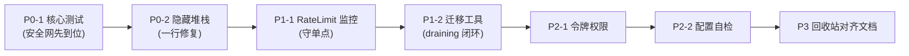

# Edge Image Gateway 生产化补强:手把手实施手册

下面把上一轮列出的七件事,逐一拆成"为什么做 → 检查清单 → 动手步骤 → 验收标准"的可执行流程。你照着这个顺序走,每完成一项都能独立验证、独立提交。我尽量贴着你现有的目录结构(`src/services/repoRouter.ts`、`src/middleware/signature.ts` 等)给出落点,代码片段是骨架草稿,变量名以你文档里出现过的为准,你按实际签名微调即可。

---

## **P0-1. 核心模块测试:给路由、签名、限流织一张安全网**

**为什么先做这个**

你的系统里有三类"错了也不报错"的逻辑:签名校验(错了=安全漏洞)、多仓库路由(错了=文件写到错误仓库)、限流(错了=要么挡不住攻击要么误伤正常用户)。这些是整套系统的正确性底线,而当前 `tests/` 只有一个 `index.spec.ts`。先补这块,后面所有改动都有回归保护。

**动手前先检查这些**

先把三个被测模块的"对外契约"摸清楚,这决定了你测试要断言什么:

- 打开 `src/services/repoRouter.ts`,确认 `resolveForRead(path)` 和 `resolveForWrite()` 的返回类型(是返回 `RepoMeta` 还是 repo id)、它们读取哪些 KV 键(`route::read_rules`、`route::current_write`、`path::{path}`)、容量超限的判断常量写在哪。
- 打开 `src/middleware/signature.ts`,确认 HMAC 的输入是哪些字段拼接的(路径 + 过期时间?)、`__internal_loopback` 和 `__share_sig` 的跳过分支在哪一行、过期时间用的是秒还是毫秒。
- 打开 `src/middleware/rateLimit.ts`,确认令牌桶的状态存在哪(KV?内存?)、key 是用 `CF-Connecting-IP` 还是别的头、桶容量和补充速率从哪个变量读。

**实施步骤**

第一步,建立测试目录结构,把不同模块拆开,别再堆在一个 spec 里:

```
tests/
├── unit/
│   ├── repoRouter.spec.ts
│   ├── signature.spec.ts
│   ├── rateLimit.spec.ts
│   └── referer.spec.ts
├── helpers/
│   └── mockKV.ts          # 构造可控的 KV mock / Miniflare 绑定
└── index.spec.ts          # 保留原有集成测试
```

第二步,写一个 KV mock 辅助函数,让你能精确控制每条 KV 记录的状态(这是测路由的关键):

```typescript
// tests/helpers/mockKV.ts
export function makeMockKV(initial: Record<string, string> = {}) {
  const store = new Map(Object.entries(initial));
  return {
    get: async (k: string) => store.get(k) ?? null,
    put: async (k: string, v: string) => { store.set(k, v); },
    delete: async (k: string) => { store.delete(k); },
    _store: store, // 测试里直接断言用
  };
}
```

第三步,针对 `repoRouter` 写**决策路径**测试。重点不是覆盖率,而是把每条分支单独逼出来:

```typescript
// tests/unit/repoRouter.spec.ts
import { describe, it, expect } from 'vitest';
import { makeMockKV } from '../helpers/mockKV';

describe('resolveForWrite', () => {
  it('当前写仓库未满 → 返回当前写仓库', async () => {
    const kv = makeMockKV({
      'route::current_write': 'repo-a',
      'repo::repo-a': JSON.stringify({ id: 'repo-a', sizeBytes: 1e9, capacityBytes: 5e9, status: 'active' }),
    });
    // const result = await resolveForWrite({ REPO_REGISTRY: kv, ...env });
    // expect(result.id).toBe('repo-a');
  });

  it('当前写仓库已满 → 自动切换到下一个 active 仓库', async () => {
    const kv = makeMockKV({
      'route::current_write': 'repo-a',
      'repo::repo-a': JSON.stringify({ id: 'repo-a', sizeBytes: 5e9, capacityBytes: 5e9, status: 'active' }),
      'repo::repo-b': JSON.stringify({ id: 'repo-b', sizeBytes: 0, capacityBytes: 5e9, status: 'active' }),
    });
    // 断言切换到 repo-b,并断言 route::current_write 被更新
  });

  it('KV 不可用 → 回退到环境变量默认仓库', async () => {
    const kv = { get: async () => { throw new Error('KV down'); }, put: async () => {} };
    // 断言返回 env.GITHUB_REPO 构造的兜底仓库,且不抛异常
  });
});

describe('resolveForRead', () => {
  it('命中 path:: 精确索引 → 直接定位仓库', async () => { /* ... */ });
  it('未命中索引但命中 read_rules 前缀 → 走前缀规则', async () => { /* ... */ });
  it('全部未命中 → 兜底到当前写仓库', async () => { /* ... */ });
});
```

第四步,`signature` 测试要专门攻击"绕过"场景,这是安全测试的核心思路——你要假装自己是攻击者:

```typescript
// tests/unit/signature.spec.ts
describe('Signature Guard', () => {
  it('合法签名 + 未过期 → 放行', async () => { /* ... */ });
  it('签名正确但已过期 → 拒绝', async () => { /* exp 设为过去时间 */ });
  it('伪造签名(随机字符串)→ 拒绝', async () => { /* ... */ });
  it('篡改路径但复用旧签名 → 拒绝', async () => { /* 关键:防止换路径重放 */ });
  it('EMERGENCY_LOCKDOWN=true → 所有写请求拒绝(返回 503)', async () => { /* ... */ });
  it('带合法 __internal_loopback 签名 → 跳过中间件', async () => { /* ... */ });
  it('伪造 __internal_loopback 签名 → 不应被跳过', async () => { /* 这条最重要 */ });
});
```

第五步,`rateLimit` 测试要能控制时间(令牌桶依赖时间补充),用 Vitest 的 fake timers:

```typescript
import { vi } from 'vitest';
describe('Rate Limiter', () => {
  it('桶内有令牌 → 放行并扣减', async () => { /* ... */ });
  it('令牌耗尽 → 返回 429', async () => { /* 连续请求超过 RATE_LIMIT_PER_MIN */ });
  it('时间推进后令牌补充 → 重新放行', async () => {
    vi.useFakeTimers();
    // 耗尽 → 推进 60s → 再次请求应放行
    vi.useRealTimers();
  });
  it('不同 IP 互不影响', async () => { /* ... */ });
});
```

**怎么算做完了(验收标准)**

`pnpm test` 全绿;上面列的每条 `it` 都有真实断言而不是空壳;特别确认"伪造 loopback 签名不被跳过"和"换路径重放被拒绝"这两条**确实是红→绿**(可以先故意把校验逻辑注释掉,看测试是否变红,确认测试真的有效)。

---

## **P0-2. 生产环境隐藏堆栈信息:堵住一行就能修的信息泄露**

**为什么做**

`architecture.md` 的错误处理架构里,`app.onError` 直接把 `stack` 放进 JSON 响应返回给客户端。堆栈会暴露内部文件路径、依赖版本、甚至部分变量,是典型的信息泄露,攻击者会拿它做侦察。

**动手前先检查**

- 找到 `src/index.ts` 里的 `app.onError(...)` 实现。
- 确认你怎么区分环境:Workers 通常用 `wrangler.toml` 的 `[env.production]` 或一个 `ENVIRONMENT` 变量。如果目前没有这个变量,顺手加一个。

**实施步骤**

第一步,在 `wrangler.toml.example` 和你的 `wrangler.toml` 里加环境标记:

```toml
[vars]
ENVIRONMENT = "production"   # 本地 dev 时设为 "development"
```

第二步,改造错误处理器,生产环境只返回一个可追踪的 error id,把详情送 Sentry:

```typescript
// src/index.ts
app.onError((err, c) => {
  const errorId = crypto.randomUUID();
  const isDev = c.env.ENVIRONMENT !== 'production';

  console.error(`[${errorId}]`, err.stack ?? err);

  // 上报 Sentry / Telegram(把 errorId 一起带上,便于关联)
  reportToSentry(err, { errorId, env: c.env });
  if (isServerError(err)) notifyTelegram(`5xx ${errorId}: ${err.message}`, c.env);

  const body = isDev
    ? { error: 'Unhandled Exception', message: err.message, stack: err.stack, errorId }
    : { error: 'Internal Server Error', errorId };

  return c.json(body, 500);
});
```

**验收标准**

本地 `ENVIRONMENT=development` 时响应仍带 stack(方便调试);把它改成 `production` 重新 `pnpm dev`,故意触发一个异常,确认响应里**只有 `error` 和 `errorId`,没有 `stack` 和 `message`**;同时 console 和 Sentry 里能用同一个 `errorId` 查到完整堆栈。

---

## **P1-1. GitHub Rate Limit 监控与告警:守住架构最脆弱的单点**

**为什么做**

整套架构的读写最终都落到 GitHub REST API,而 GitHub 对每个 token 有每小时配额(认证后通常 5000 次/小时)。多仓库 + Cron 容量同步 + 上传/读取回源,很容易在流量高峰触顶。一旦配额耗尽,网关的读和写会同时失败,而你现在**完全看不到这个余量**。

**动手前先检查**

- 打开 `src/services/github.ts`,看 `fetchRaw`/`putFile` 等方法发请求后,是否读取过响应头里的 `X-RateLimit-Remaining`、`X-RateLimit-Limit`、`X-RateLimit-Reset`。大概率没读。
- 确认你想把这个余量缓存到哪:建议复用 KV,加一个 `kv_config::github_rate` 或独立键 `github_rate::{token_id}`(多 token 隔离时按 token 分别记)。

**实施步骤**

第一步,在 GitHub 服务的统一请求出口(如果没有,建议先抽一个 `request()` 私有方法把所有 fetch 收敛进去)里,解析速率头并写入 KV:

```typescript
// src/services/github.ts
private async request(url: string, init: RequestInit, repoId: string) {
  const res = await fetch(url, init);

  const remaining = Number(res.headers.get('X-RateLimit-Remaining'));
  const limit = Number(res.headers.get('X-RateLimit-Limit'));
  const reset = Number(res.headers.get('X-RateLimit-Reset')); // epoch 秒

  if (!Number.isNaN(remaining)) {
    await this.kv.put(`github_rate::${repoId}`, JSON.stringify({ remaining, limit, reset, at: Date.now() }));

    // 阈值告警:余量低于 10% 时通知
    if (limit > 0 && remaining / limit < 0.1) {
      await notifyTelegram(`⚠️ GitHub rate limit 余量不足: ${remaining}/${limit}, repo=${repoId}, reset=${new Date(reset * 1000).toISOString()}`, this.env);
    }
  }

  if (res.status === 403 && remaining === 0) {
    // 配额耗尽,抛一个可识别的错误类型,让上层走降级/缓存
    throw new RateLimitExhaustedError(repoId, reset);
  }
  return res;
}
```

第二步,在 `/healthz` 里把速率余量暴露出来(这样监控系统可以主动拉取):

```typescript
// src/routes 里的 healthz 处理
const rates = await Promise.all(repoIds.map(async id => {
  const raw = await kv.get(`github_rate::${id}`);
  return { repo: id, ...(raw ? JSON.parse(raw) : { remaining: null }) };
}));
return c.json({ status: 'ok', githubRate: rates, /* ...其它健康信息 */ });
```

第三步(可选但推荐),在 Cron 同步任务里加一道"配额预算检查":如果某 token 余量已经很低,这一轮就跳过该仓库的统计同步,避免 Cron 自己把配额耗光,反而拖垮线上读写。

**应该检查什么**

确认每一类 GitHub 调用(读、写、tree、create repo)都经过了这个统一出口,否则会有"漏网"的调用不被计量;确认多 token 场景下 key 是按 token/repo 隔离的,别把不同 token 的余量混成一个数。

**验收标准**

正常调用几次后,KV 里能看到 `github_rate::*` 记录且数值随调用递减;把告警阈值临时调到 `< 0.99` 触发一次,确认 Telegram 收到通知;`/healthz` 返回体里能看到各仓库的 `remaining/limit/reset`。

---

## **P1-2. 多仓库迁移工具:让 draining 状态真正闭环**

**为什么做**

`draining`(迁移中)状态在文档里定义了,FAQ 也说"旧仓库文件可迁移",但没有任何端点或脚本真正执行迁移。结果是:管理员把仓库标成 `draining` 后,文件并不会自己搬走,而 `path::{path}` 索引仍指向旧仓库。这个状态目前是"空头支票"。

**动手前先检查**

- 确认 `src/services/github.ts` 是否同时具备"读原文件"(`fetchRaw`/`getFile`)和"写新文件"(`putFile`)——迁移本质就是读源 + 写目标 + 改索引 + 删源。
- 确认 `getTree` 能列出源仓库的全部文件路径(分页处理了吗?大仓库一定会分页)。
- 想清楚迁移过程中的**读一致性**:迁移到一半时,某个文件可能源、目标都在,读路由该指向谁?建议策略是"先写目标 + 改索引指向目标 + 验证 + 再删源",这样任意时刻索引指向的副本都存在。

**实施步骤**

第一步,设计迁移任务的状态记录(支持断点续传,因为大仓库一定会被 rate limit 打断):

```
KV 键: migration::{jobId}
值: {
  jobId, sourceRepo, targetRepo,
  status: 'running' | 'paused' | 'done' | 'failed',
  cursor: "上次处理到的文件路径或 tree 分页游标",
  total, migrated, failed,
  errors: [{ path, reason }],
  startedAt, updatedAt
}
```

第二步,写迁移核心逻辑(放在 `src/services/migration.ts`,新建一个文件):

```typescript
// src/services/migration.ts (骨架)
export async function migrateRepo(job, env) {
  const files = await github.getTree(job.sourceRepo, { cursor: job.cursor });

  for (const file of files) {
    try {
      // 1. 读源
      const content = await github.fetchRaw(job.sourceRepo, file.path);
      // 2. 写目标(幂等:先 fileExists 判断,已存在则跳过)
      if (!(await github.fileExists(job.targetRepo, file.path))) {
        await github.putFile(job.targetRepo, file.path, content);
      }
      // 3. 改索引指向目标
      await kv.put(`path::${file.path}`, JSON.stringify({ repo: job.targetRepo, sha: file.sha }));
      // 4. 验证目标可读后,再删源
      if (await github.fileExists(job.targetRepo, file.path)) {
        await github.deleteFile(job.sourceRepo, file.path);
      }
      job.migrated++;
    } catch (e) {
      if (e instanceof RateLimitExhaustedError) {
        // 5. 配额耗尽 → 保存游标,暂停,等下一轮 Cron 续跑
        job.status = 'paused';
        job.cursor = file.path;
        await saveJob(job, kv);
        return;
      }
      job.failed++;
      job.errors.push({ path: file.path, reason: String(e) });
    }
    await saveJob(job, kv); // 每个文件都落盘,保证断点精确
  }
  job.status = 'done';
  // 全部迁移完且 source 为空 → 可把 sourceRepo 状态置为 archived
  await saveJob(job, kv);
}
```

第三步,挂管理 API 端点(对齐你现有的 `/admin/api/repos/...` 风格):

```
POST   /admin/api/repos/:id/migrate     # body: { targetRepo } 启动迁移,返回 jobId
GET    /admin/api/migrations/:jobId      # 查询进度
POST   /admin/api/migrations/:jobId/resume   # 手动续跑(也可由 Cron 自动续)
```

第四步,在 `src/services/cron.ts` 里加一段:每次 Cron 触发时,检查有没有 `status: 'paused'` 的迁移任务,有就自动续跑一批。这样大仓库迁移会被 rate limit 自然地切成多轮,无需人盯。

**应该检查什么**

迁移必须**幂等**——任务中途崩溃重跑,不能产生重复写或漏删,所以每步前都要判断"目标是否已存在";删源一定要放在"目标验证可读"之后,否则一旦目标写失败就丢数据;`getTree` 的分页游标要正确持久化到 `cursor`。

**验收标准**

造一个有几十个文件的测试源仓库,启动迁移后:目标仓库出现全部文件、`path::*` 索引全部指向目标、源仓库被清空、`migration::{jobId}` 状态变 `done`;故意在中途模拟一次 rate limit 异常,确认任务变 `paused` 且 `cursor` 记到了正确位置,下一轮能从断点续上、最终不重不漏。

---

## **P2-1. API 令牌:加上权限粒度与生命周期**

**为什么做**

当前令牌只有"能用/吊销"两态。对一个支持程序化访问、且能删文件的网关,一旦令牌泄露,攻击者就能删库。加上**权限范围**(读/写/删分离)、**路径前缀限制**、**过期时间**和**最后使用时间**,能把单个令牌泄露的爆炸半径压到最小。

**动手前先检查**

- 找到现在令牌存在哪、校验在哪(很可能在 `adminAuth.ts` 或 upload/files 的鉴权里)。
- 确认令牌当前的数据结构,看能否平滑加字段(老令牌要兼容,不能加了字段就全失效)。

**实施步骤**

第一步,扩展令牌数据模型(存 KV,如 `api_token::{tokenId}`):

```typescript
interface ApiToken {
  id: string;
  name: string;
  hash: string;              // 只存 token 的哈希,别存明文
  scopes: ('read' | 'write' | 'delete')[];   // 权限范围
  pathPrefix?: string;       // 可选:限制只能访问某前缀,如 "/photos/"
  expiresAt?: number;        // 可选过期时间
  createdAt: number;
  lastUsedAt?: number;       // 每次使用回写
  revoked: boolean;
}
```

第二步,写一个统一的鉴权检查函数,让所有需要令牌的端点都过它:

```typescript
async function authorizeToken(token, { action, path }, kv): Promise<boolean> {
  const rec = await getTokenByHash(hash(token), kv);
  if (!rec || rec.revoked) return false;
  if (rec.expiresAt && Date.now() > rec.expiresAt) return false;
  if (!rec.scopes.includes(action)) return false;                 // 权限不足
  if (rec.pathPrefix && !path.startsWith(rec.pathPrefix)) return false; // 越权路径
  // 异步回写 lastUsedAt(别阻塞主流程,用 waitUntil)
  ctx.waitUntil(updateLastUsed(rec.id, kv));
  return true;
}
```

第三步,改造令牌生成 UI/API,允许创建时勾选 scope、填 pathPrefix 和有效期;令牌列表页显示 `lastUsedAt`(便于识别僵尸令牌)。

**应该检查什么**

务必**只存哈希不存明文**(若现状是明文,这次顺手改掉);老令牌没有 `scopes` 字段时要有默认值兜底(比如默认给全权限,避免升级即全挂,但要在文档里提示管理员重建令牌);`lastUsedAt` 回写用 `ctx.waitUntil` 别拖慢响应。

**验收标准**

创建一个只有 `read` scope 的令牌,用它调删除接口应返回 403;创建一个 `pathPrefix=/photos/` 的令牌,访问 `/docs/x.png` 应被拒;令牌过期后自动失效;令牌列表能看到最近使用时间。

---

## **P2-2. 启动期配置自检:把配错前置到部署阶段**

**为什么做**

近二十个环境变量,很多是 Secret。现在配错(比如 `SIGN_SECRET` 没填、Telegram 只配了一半)往往要等第一个相关请求才暴露。用你已经引入的 Zod 在入口做一次校验,能让 `/healthz` 直接告诉你"哪个配置有问题",而不是线上才翻车。

**动手前先检查**

- 确认 `src/types/env.d.ts` 里的环境变量清单,和 `README` 配置表对齐(看有没有遗漏或改名)。
- 理清哪些是"必填"、哪些是"要么都配要么都不配"(典型:`TELEGRAM_BOT_TOKEN` 和 `TELEGRAM_CHAT_ID`;`CF_ZONE_ID` 和 `CF_API_TOKEN`)。

**实施步骤**

第一步,用 Zod 定义配置 schema(放 `src/utils/configCheck.ts`):

```typescript
import { z } from 'zod';

const envSchema = z.object({
  GITHUB_USER: z.string().min(1),
  GITHUB_REPO: z.string().min(1),
  GITHUB_TOKEN: z.string().min(1),
  GITHUB_BRANCH: z.string().min(1).default('main'),
  SIGN_SECRET: z.string().min(16, 'SIGN_SECRET 至少 16 字符'),
  CACHE_TTL_SECONDS: z.coerce.number().int().positive().optional(),
  RATE_LIMIT_PER_MIN: z.coerce.number().int().positive().optional(),
  ENVIRONMENT: z.enum(['development', 'production']).default('production'),
}).superRefine((env, ctx) => {
  // 成对配置校验
  const tgPaired = !!env.TELEGRAM_BOT_TOKEN === !!env.TELEGRAM_CHAT_ID;
  if (!tgPaired) ctx.addIssue({ code: 'custom', message: 'TELEGRAM_BOT_TOKEN 与 TELEGRAM_CHAT_ID 必须同时配置' });
  const cfPaired = !!env.CF_ZONE_ID === !!env.CF_API_TOKEN;
  if (!cfPaired) ctx.addIssue({ code: 'custom', message: 'CF_ZONE_ID 与 CF_API_TOKEN 必须同时配置' });
});

export function checkConfig(env) {
  const result = envSchema.safeParse(env);
  return result.success
    ? { ok: true as const }
    : { ok: false as const, issues: result.error.issues.map(i => `${i.path.join('.')}: ${i.message}`) };
}
```

第二步,在 `/healthz` 里调用它,把配置健康度报告出来(注意:**绝不要把 Secret 的值打印出来**,只报告"是否合法"):

```typescript
const cfg = checkConfig(c.env);
return c.json({
  status: cfg.ok ? 'ok' : 'config_error',
  config: cfg.ok ? 'valid' : cfg.issues,  // 只报字段名和原因,不报值
});
```

第三步(可选),把 `checkConfig` 也接入一个 `pnpm` 脚本,在 CI/部署前跑一次,配置不合法直接让部署失败。

**应该检查什么**

确认错误信息里**只有字段名和原因,没有任何 Secret 明文**;`.default()` 的字段要和 `README` 里写的默认值一致(比如 branch=`main`、TTL=`604800`);`z.coerce.number()` 处理好"环境变量都是字符串"这个事实。

**验收标准**

故意删掉 `SIGN_SECRET` 重启,`/healthz` 返回 `config_error` 并指明 `SIGN_SECRET` 缺失;只配 `TELEGRAM_BOT_TOKEN` 不配 chat id,能报出"必须同时配置";配置齐全时返回 `valid`。

---

## **P3. 回收站数据模型:对齐文档与实现**

**为什么做**

`USAGE.md` 多次提到"回收站""清空回收站",但 `architecture.md` 的 KV 键设计表里没有任何回收站相关的键。这说明:要么回收站是真功能但文档漏写了数据模型,要么它目前只是个 UI 概念、删除其实是直删 GitHub。无论哪种,文档和实现不一致都是接手者的坑。

**动手前先检查**

- 在 `src/routes/admin/api/files/mutate.ts`(文件删除逻辑)里确认:删除时是直接 `github.deleteFile` 真删,还是有"软删除"动作。
- 如果是真删,那"回收站"目前无法恢复,需要决定是"补实现"还是"改文档去掉回收站表述"。

**实施步骤(以"补一个轻量软删除"为例)**

第一步,定义回收站 KV 模型并补进 `architecture.md` 的键设计表:

```
trash::{trashId} → {
  trashId, originalPath, repo, sha,
  deletedAt, deletedBy,
  expiresAt   // 回收站保留期,如 30 天后随 Cron 真删
}
```

第二步,改删除逻辑为"软删除":真删 GitHub 文件前(或后),把元信息写入 `trash::*`,这样 KV 里留有可恢复的记录(注意:GitHub 真删后内容已不在,若要支持"恢复内容"则需在软删除时把内容暂存到一个 trash 仓库或保留 sha 以便从 git 历史恢复——这点要在文档里讲清楚能恢复到什么程度)。

第三步,加恢复与清空端点,并在 Cron 里加"超过 `expiresAt` 的回收站记录自动清理":

```
GET    /admin/api/trash            # 列出回收站
POST   /admin/api/trash/:id/restore
DELETE /admin/api/trash            # 清空
```

第四步,**最关键的一步**:把你最终采用的方案写回 `architecture.md` 和 `USAGE.md`,让"回收站到底能恢复什么、保留多久"白纸黑字一致。

**验收标准**

文档里有回收站的 KV 键定义;删除文件后能在回收站列表看到记录;恢复功能行为与文档描述一致;过期记录会被 Cron 清理。

---

## **建议的执行节奏**

不要七件事一起开,按下面的顺序一项一项来,每项独立成一个 commit/PR,这样出问题好回退:



之所以把测试放最前,是因为后面每改一处(尤其是迁移工具会动到路由和索引),都需要 P0-1 那张网帮你兜回归。每完成一项,跑一遍 `pnpm typecheck && pnpm test`,绿了再进下一项。

如果你在动手过程中卡在某个具体函数的签名对接上(比如 `resolveForWrite` 实际返回什么、`putFile` 的参数顺序),把那个文件的真实代码贴给我,我帮你把上面的骨架精确对齐到你的实现。需要我先把某一项(比如 P0-1 的完整测试文件,或 P1-2 迁移服务的完整可运行版本)写到能直接粘贴的程度,告诉我从哪项开始就行。

*内容由 AI 生成仅供参考*