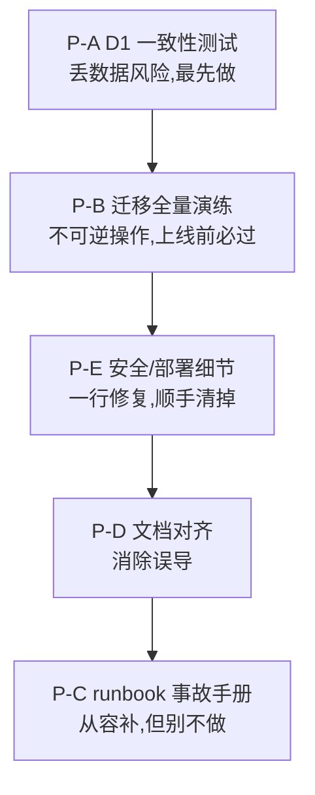

# Edge Image Gateway 收尾阶段实施手册:从"功能齐全"到"敢交付"

这一版你已经把功能做满了,所以下面这份手册的重心和上一份完全不同——它不再教你"加什么",而是教你"怎么验证已有的东西不会暴雷、出事了怎么退、文档怎么对齐"。我按上一轮收尾建议的五项,逐一拆成"为什么 → 动手前检查什么 → 实施步骤 → 验收标准"。仍然是骨架代码,变量名贴着你 `architecture-overview.md` 里出现过的实际命名(`paths` 表、`repo::{id}`、`resolveForRead`、`repoMigration.ts` 等),你按真实签名微调。

---

## **P-A. D1 双写一致性验证:堵住"写了一半"和"D1 挂了"两类暴雷**

**为什么这是第一优先级**

你现在是 "D1 主 + KV 降级" 双写。双写架构真正的杀手不是"写失败"(那会报错,你能发现),而是**写了一半**:D1 成功、KV 失败,或反过来。一旦两边漂移,`resolveForRead` 从 D1 拿到 A 仓库、降级时从 KV 拿到 B 仓库,文件就"凭空消失"了。这类 bug 平时不发作,一发作就是丢数据级别,且极难复现。所以必须用测试把它逼出来。

**动手前先检查这些**

- 打开 `src/services/database.ts`,把所有"同时写 D1 和 KV"的方法找出来列个清单(大概率涉及:写路径索引、改 `route::current_write`、增删仓库、写 token)。确认每个方法里 D1 写和 KV 写的**先后顺序**,以及中间出错时有没有 try/catch。
- 打开 `src/services/repoRouter.ts` 的 `resolveForRead`,确认它的降级链顺序——文档写的是 D1 精确查 → KV 降级 → 前缀规则 → 当前写仓库兜底 → 首个可用 → 环境变量。重点看:D1 调用如果**抛异常**(不是返回空,是直接 throw),会不会让整个降级链中断。
- 核对 `scripts/schema.sql` 里 `paths`、`repos`、`auth_tokens`、`system_config` 的列名,和 `database.ts` 里 SQL 语句实际用的列名是否**逐字一致**(双写架构里列名拼错是高频坑,且 D1 不会在类型层面替你挡住)。

**实施步骤**

第一步,先决定一个一致性原则,后面所有代码都围绕它写。对这种"主+降级"架构,推荐 **D1 为准、KV 尽力同步**:

```
写入顺序:先写 D1(主)→ 成功后再写 KV(降级镜像)
- D1 写失败 → 整个操作失败并回滚,不写 KV(避免 KV 有、D1 没有)
- D1 成功、KV 失败 → 不算致命:记一条 warning 日志 + 上报,后续靠"对账任务"补 KV
读取顺序:D1 优先,D1 不可用才读 KV
```

这样最坏情况是"KV 比 D1 旧",而读取永远优先 D1,数据不会真正丢。把这个原则写进 `docs/architecture.md`,让后人知道为什么这么排。

第二步,改造 `database.ts` 的双写方法,让"写一半"变成可观测而不是静默:

```typescript
// src/services/database.ts(骨架)
async function putPathIndex(path: string, repoId: string, env): Promise<void> {
  // 1. 先写主存储 D1,失败直接抛(让上层回滚/报错)
  await env.DB.prepare('INSERT OR REPLACE INTO paths (path, repo_id, ...) VALUES (?, ?, ...)')
    .bind(path, repoId).run();

  // 2. 再写 KV 镜像,失败不致命但必须留痕
  try {
    await env.REPO_REGISTRY.put(`path::`, JSON.stringify({ repoId }));
  } catch (e) {
    logger.warn('kv_mirror_failed', { key: `path::`, repoId, error: String(e) });
    // 标记一条待对账记录,供后续对账任务修复
    ctx.waitUntil(env.REPO_REGISTRY.put(`reconcile::path::`, repoId, { expirationTtl: 86400 }).catch(() => {}));
  }
}
```

第三步,加固 `resolveForRead` 的降级链,确保 **D1 抛异常时不会中断整条链**,而是落到下一级:

```typescript
// src/services/repoRouter.ts(骨架)
async function resolveForRead(path: string, env) {
  // 第一级:D1 精确查,用 try/catch 包住,挂了不能让整个函数崩
  try {
    const row = await env.DB.prepare('SELECT repo_id FROM paths WHERE path = ?').bind(path).first();
    if (row?.repo_id) return loadRepo(row.repo_id, env);
  } catch (e) {
    logger.warn('d1_read_failed_fallback_to_kv', { path, error: String(e) });
  }
  // 第二级:KV 降级
  try {
    const kvRaw = await env.REPO_REGISTRY.get(`path::`);
    if (kvRaw) return loadRepo(JSON.parse(kvRaw).repoId, env);
  } catch (e) {
    logger.warn('kv_read_failed', { path, error: String(e) });
  }
  // 第三~六级:前缀规则 → 当前写仓库 → 首个可用 → 环境变量兜底
  return resolveByRulesAndFallback(path, env);
}
```

第四步,写专门的一致性测试。这是本项的核心产出,要造出"半写"和"D1 挂"两类场景:

```typescript
// tests/unit/consistency.spec.ts(骨架)
import { describe, it, expect, vi } from 'vitest';

describe('双写一致性', () => {
  it('D1 写成功但 KV 写失败 → 不抛致命错误,且留下 reconcile 记录', async () => {
    const db = makeMockD1({ /* 正常 */ });
    const kv = { put: vi.fn().mockRejectedValue(new Error('KV down')), get: async () => null };
    // await putPathIndex('/a.jpg', 'repo-a', { DB: db, REPO_REGISTRY: kv });
    // 断言:D1 里有 /a.jpg → repo-a;调用未抛错;reconcile::path::/a.jpg 被尝试写入
  });

  it('D1 写失败 → 整个操作抛错,KV 不应被写入(避免 KV 有 D1 没有)', async () => {
    const db = { prepare: () => ({ bind: () => ({ run: async () => { throw new Error('D1 down'); } }) }) };
    const kv = { put: vi.fn(), get: async () => null };
    // await expect(putPathIndex(...)).rejects.toThrow();
    // 断言:kv.put 从未被调用
  });

  it('resolveForRead:D1 抛异常 → 平滑降级到 KV,返回正确仓库', async () => {
    const db = { prepare: () => ({ bind: () => ({ first: async () => { throw new Error('D1 down'); } }) }) };
    const kv = makeMockKV({ 'path::/a.jpg': JSON.stringify({ repoId: 'repo-kv' }) });
    // const repo = await resolveForRead('/a.jpg', { DB: db, REPO_REGISTRY: kv });
    // expect(repo.id).toBe('repo-kv');
  });

  it('D1 与 KV 不一致(D1=repo-a, KV=repo-b)→ 读取以 D1 为准', async () => {
    const db = makeMockD1({ paths: { '/a.jpg': 'repo-a' } });
    const kv = makeMockKV({ 'path::/a.jpg': JSON.stringify({ repoId: 'repo-b' }) });
    // expect((await resolveForRead('/a.jpg', { DB: db, REPO_REGISTRY: kv })).id).toBe('repo-a');
  });
});
```

第五步(可选但强烈建议),写一个轻量**对账任务**挂到 Cron:扫描 `reconcile::*` 标记,把 KV 缺的镜像从 D1 补回去,补成功就删标记。这样即使发生 KV 半写,系统也能自愈。

**应该检查什么**

每个双写方法都要确认 D1 在前、KV 在后;`resolveForRead` 的每一级 D1/KV 调用都被 try/catch 包住,不能有任何一级抛出后中断降级;`schema.sql` 列名与 SQL 语句逐字核对一遍。

**验收标准**

`tests/unit/consistency.spec.ts` 全绿,且"D1 写失败时 KV 不被写入""D1 挂掉读取自动走 KV""D1/KV 冲突时以 D1 为准"这三条确认是真实红→绿(先注释掉对应逻辑看测试是否变红);手动在本地把 D1 绑定临时改成一个会报错的 mock,跑一次读图请求,确认能降级返回而不是 500。

---

## **P-B. 迁移引擎全量演练 + 并发竞态处理:把不可逆操作变成可信操作**

**为什么是第二优先级**

`repoMigration.ts` 里有"写目标 → 更新索引 → **删除源文件**"这步,删源不可逆。顺序对不代表生产安全,这种操作上线前必须有一次真实全量演练,并处理一个你文档里还没明说的竞态:**迁移进行中有用户正在读这些文件**。

**动手前先检查**

- 打开 `src/services/repoMigration.ts`,确认四步顺序确实是"检查目标存在 → 读源 → 写目标 → 更新索引(D1+KV)→ 删源",且**删源严格在索引更新成功之后**。
- 确认断点续传的游标 `cursor` 存在 `repo_migration::{jobId}`(KV)还是 `migration_tasks` 表(D1),以及它记录的是文件路径还是 Tree 分页游标。
- 确认迁移启动时,源仓库的状态是否被置为 `draining`,以及 `draining` 状态在 `resolveForWrite` 里是否真的被排除出写目标(只读)。

**实施步骤**

第一步,先处理竞态——这是演练之前必须先写好的代码。关键时间窗是"源已删、但某一级索引还没更新过来"。最稳妥的做法是**调整顺序为"先更新索引指向目标,确认目标可读,再删源"**,并让 `draining` 期间源仓库只读:

```typescript
// src/services/repoMigration.ts(单文件迁移骨架,顺序是关键)
async function migrateOneFile(file, job, env) {
  // 1. 幂等:目标已存在则跳过写入(支持重跑)
  if (!(await github.fileExists(job.targetRepo, file.path))) {
    const content = await github.fetchRaw(job.sourceRepo, file.path);
    await github.putFile(job.targetRepo, file.path, content);
  }
  // 2. 先把索引切到目标(D1 主 + KV 镜像),此刻读路由已指向目标
  await db.putPathIndex(file.path, job.targetRepo, env);
  // 3. 验证目标确实可读(双重保险)
  if (!(await github.fileExists(job.targetRepo, file.path))) {
    throw new Error(`target verify failed: `);
  }
  // 4. 最后才删源(此时即使删源后有请求,索引也已指向目标,不会 404)
  await github.deleteFile(job.sourceRepo, file.path);
}
```

第二步,确保 `draining` 状态在写路由里被排除,避免迁移途中新文件又写进正在被掏空的源仓库:

```typescript
// src/services/repoRouter.ts - resolveForWrite 里
const candidates = allRepos.filter(r => r.status === 'active'); // draining/readonly/archived 全部排除
```

第三步,设计并执行**全量演练脚本**(可以放 `scripts/migrate-dryrun.ts`,或直接用管理 API 操作),演练对象用一个真实的、有几十到上百文件的测试仓库:

```
演练流程:
1. 准备源仓库 S(造 100+ 个文件,记录文件清单和总数 N_src)
2. 启动迁移 S → T:POST /admin/api/repos/{S}/migrate { targetRepo: T }
3. 中途人为打断一次(模拟 rate limit:可临时把 github 请求 mock 成抛 RateLimitExhaustedError)
4. 等 Cron 自动续跑(或手动 resume),直到 status=done
5. 逐项核对(见下方验收标准)
```

第四步,演练中专门验证竞态:在迁移进行到一半时,对**已迁移**和**未迁移**的文件各发起一次读请求,确认两者都能 200 返回(已迁移的从 T 读,未迁移的仍从 S 读)。

**应该检查什么**

删源一定在"索引更新 + 目标验证"之后;`fileExists` 幂等判断确实生效(重跑不重复写);`draining` 在写路由被排除;断点续传的 `cursor` 在打断后记录到了正确位置;Tree API 分页在大仓库下没有漏页。

**验收标准**

演练后 T 的文件数 == 源 N_src;`paths` 表与 KV `path::*` 全部指向 T 且两边一致;S 被置为 `archived`;中途打断后续跑做到不重不漏;迁移半程中对已迁移/未迁移文件的读请求都不 404。把这次演练的核对结果记录到一份 `docs/migration-dryrun-report.md`,作为"这功能真的验过"的凭证。

---

## **P-C. 事故响应手册 runbook.md:给所有"红色按钮"配上收场剧本**

**为什么需要**

你装了一堆保险丝(`EMERGENCY_LOCKDOWN`、404 封禁、容量/速率告警),但没有"按下之后怎么收场"的文档。一个能删库、能熔断的系统,事故手册的价值高于任何新功能。凌晨告警响的时候,你需要的是照着抄的步骤,不是临场翻代码。

**动手前先检查**

- 梳理清楚每个"红色按钮"实际怎么操作:`EMERGENCY_LOCKDOWN` 是改 `wrangler.toml` 重新 deploy,还是写某个 KV 键就生效?(如果是后者,恢复会快很多,值得确认。)
- 确认回收站走的是"真删"路线,那误删恢复就只能靠 GitHub commit 历史——先自己实测一次"从 git 历史恢复一个被删文件"的完整命令,把它写进手册。
- 确认 token 轮换路径:每仓库独立 token(`tokenSecretName`)的更新是 `wrangler secret put` 还是管理面板?

**实施步骤**

新建 `docs/runbook.md`,按"症状 → 处置 → 恢复 → 验证"四段式写。下面是骨架,你把每段的实际命令填进去:

```markdown
# Edge Image Gateway 事故响应手册 (Runbook)

## 场景 1:疑似被攻击 / 写入异常,需要紧急止血
- 症状:写入激增、审计日志异常、Telegram 告警刷屏
- 处置:开启紧急熔断
  - 操作:[填入实际操作,如 `wrangler ... ` 或写 KV `kv_config::emergency_lockdown=true`]
  - 效果:所有写操作被拒,读不受影响
- 恢复:确认威胁排除后,关闭熔断 [填操作]
- 验证:发一个测试上传确认恢复;检查 `/healthz` 的 lockdown 状态

## 场景 2:GitHub Token 泄露
- 处置:1) GitHub 后台立即吊销该 token  2) 生成新 token  3) 更新 secret [填 `wrangler secret put ...`]
- 若是某仓库独立 token:更新该仓库的 tokenSecretName
- 验证:读写测试 + 检查 github_rate 是否恢复正常

## 场景 3:某 GitHub 仓库故障(持续 5xx / 不可用)
- 处置:把该仓库状态改为 readonly 或 archived,并切换 route::current_write 到健康仓库
  - 操作:管理面板 仓库管理 → 改状态 + 改写目标,或 [填 API/KV 操作]
- 验证:新上传落到健康仓库;故障仓库的读请求确认走了缓存或降级

## 场景 4:误删文件需要恢复(回收站为真删,靠 git 历史)
- 处置:[填从 GitHub commit 历史恢复文件的完整命令]
- 恢复后:手动回填 paths 索引(D1 + KV),或触发 backfill 接口
- 验证:文件可正常访问

## 场景 5:GitHub Rate Limit 耗尽
- 症状:github_rate remaining=0,读写大面积失败
- 处置:临时增加 token / 暂停 Cron 同步 / 等待 reset
- 验证:/healthz 的 githubRate 恢复

## 场景 6:D1 不可用
- 症状:日志大量 d1_read_failed_fallback_to_kv
- 处置:确认系统已自动降级到 KV(P-A 已保证);评估是否暂停写入避免加剧不一致
- 恢复:D1 恢复后,跑对账任务同步 KV→D1 的增量
```

**应该检查什么**

每一条"操作"都不能是"大概这样",必须是你**真实执行过一遍、能直接复制粘贴**的命令或点击路径。尤其是场景 4 的 git 恢复,务必实测,别想当然。

**验收标准**

手册里每个场景的关键操作你都至少在测试环境实操过一次;熔断的开启/关闭、token 轮换、仓库切换、git 恢复文件这四个高频动作有逐字命令;团队里另一个人(或三个月后的你)能仅凭这份文档独立处置一次模拟事故。

---

## **P-D. 文档交叉对齐:让 README 追上真实架构**

**为什么需要**

`README.md` 还停留在"纯 KV、三级缓存"的旧版,而 `architecture-overview.md` 已经是"D1 双写、四级缓存、迁移引擎"的新版。README 是门面,现在它会误导所有第一次看项目的人(包括未来的你)。

**动手前先检查**

把两份文档并排,逐节找出口径不一致的地方。我已经替你定位了主要的四处(见下表),你扫一遍看还有没有遗漏。

**实施步骤**

以 `architecture-overview.md` 为准(它是最新的),逐项把 README 改齐:

| README 待改章节 | 现状(旧) | 改成(对齐新架构) |
|---|---|---|
| 技术栈表 | 只有 KV | 补 D1(主存储)、R2(变体缓存)、Analytics Engine(可选指标) |
| 缓存章节 | 三级(Workers+CDN+内存) | 四级:Workers(L1)+R2(L2)+Browser(L3)+Memory(L4) |
| 架构概览图 | KV 单一持久化 | 持久化层画成 D1 主 + KV 降级 + R2 变体 |
| 项目结构 | 缺 repoMigration/backfill/configCheck/r2Cache | 补齐这些新文件 |
| API 总览 | 缺迁移、Token 权限端点 | 补 `/admin/api/repos/:id/migrate`、迁移进度查询、Token scope 相关 |
| 配置表 | 缺 ENVIRONMENT 及绑定说明 | 补 ENVIRONMENT,并新增"Cloudflare 资源绑定"小节(DB/CACHE_BUCKET/ANALYTICS_ENGINE) |

同时建一个习惯:把 `architecture-overview.md` 当作**单一事实来源(single source of truth)**,README 只做摘要并链接过去,避免以后再次漂移。

**验收标准**

README 的技术栈、缓存、架构图、项目结构、API、配置六处都与 `architecture-overview.md` 不再冲突;一个完全不了解项目的人只读 README 就能正确理解"数据存在 D1 为主、KV 降级",不会以为只有 KV。

---

## **P-E. 安全与部署细节打钩:几个一行就能补但漏了会出事的点**

**为什么需要**

这一版新引入了 Cookie 会话、Analytics Engine、R2、D1 多个绑定,有几个容易漏的安全/部署细节,漏了不会立刻报错,但会在特定情况下出事(XSS 偷 cookie、别人部署起不来)。

**动手前先检查 + 逐项处置**

第一项,`admin_session` Cookie 的属性。打开 `src/middleware/adminAuth.ts`,确认签发 Cookie 时带齐了安全属性:

```typescript
// 应包含 HttpOnly(防 JS 读取)、Secure(仅 HTTPS)、SameSite(防 CSRF)
'Set-Cookie': `admin_session=; HttpOnly; Secure; SameSite=Strict; Path=/admin; Max-Age=86400`
```
检查:`HttpOnly`、`Secure`、`SameSite` 三者是否齐全,缺哪个补哪个。

第二项,`wrangler.toml.example` 的绑定模板。新架构需要 D1、R2、Analytics Engine 绑定,模板里必须有,否则别人按 README 部署会因缺绑定直接起不来:

```toml
[[kv_namespaces]]
binding = "REPO_REGISTRY"
id = "<your-kv-id>"

[[d1_databases]]
binding = "DB"
database_name = "edge-image-gateway"
database_id = "<your-d1-id>"

[[r2_buckets]]
binding = "CACHE_BUCKET"
bucket_name = "<your-r2-bucket>"

[[analytics_engine_datasets]]
binding = "ANALYTICS_ENGINE"
dataset = "<your-dataset>"

[vars]
ENVIRONMENT = "production"
```

第三项,TOTP 的口径。`architecture-overview.md` 说 `ADMIN_TOTP_SECRET` 是"预留",但 README 把 TOTP 当成已实现的双因素认证在宣传。二选一:要么在 README 给 TOTP 标注"(规划中)",要么把它补完。别让文档承诺一个没实现的安全功能。

第四项,确认管理面板 API 的 `no-cache` 真的全覆盖。`architecture-overview.md` 说所有 `/admin/api` 强制 `no-cache`,实测抽查几个返回敏感数据的端点(`/admin/api/files`、`/admin/api/audit`、token 列表),看响应头里确实有 `Cache-Control: no-store` 类的头,避免敏感数据被边缘或浏览器缓存。

**验收标准**

Cookie 三属性齐全;`wrangler.toml.example` 含全部四类绑定,拿它在一个干净环境能直接部署成功;README 的 TOTP 表述与实现一致;抽查的管理 API 响应头确认 no-cache。

---

## **建议执行节奏**



排序逻辑:**P-A 和 P-B 是"会丢数据"的级别,必须最先做且做到验收通过**;P-E 是一行一行的小修复,趁手做掉成本最低;P-D 文档对齐是消除误导;P-C 事故手册重要但不会突然炸,可以最后从容写,不过别因为"不紧急"就一直拖,它恰恰是凌晨救你命的东西。每完成一项都 `pnpm typecheck && pnpm test` 跑一遍,绿了再进下一项,并各自独立成一个 commit。

如果你动手时卡在某个具体对接上——比如 `database.ts` 里双写方法的真实签名、`repoMigration.ts` 的 cursor 到底存哪、或者 `resolveForRead` 现在的实际降级实现——把那个文件的真实代码贴给我,我把上面对应的骨架精确对齐到你的实现。需要我先把 P-A 的完整一致性测试文件,或 P-C 的 runbook 填充到可直接用的程度,告诉我从哪项切入就行。